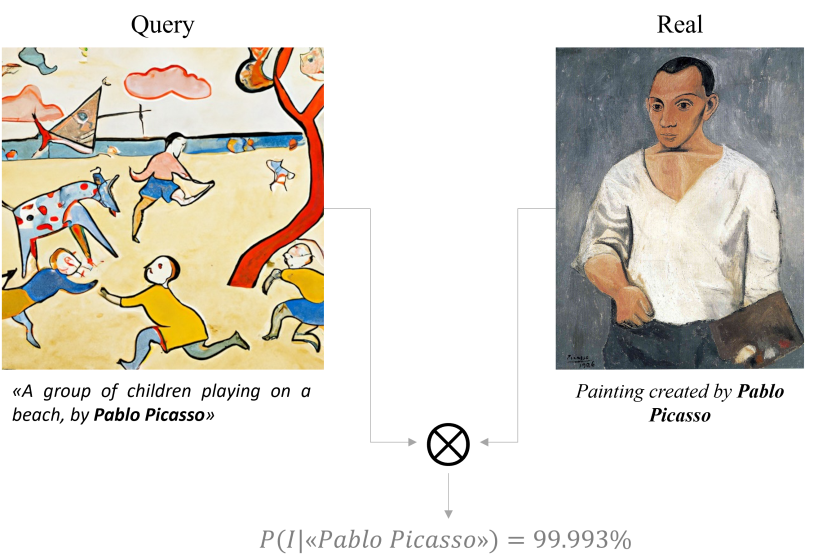

# Not with my name! Inferring artists' names of input strings employed by Diffusion Models

This is the official repository of  
  
**Not with my name! Inferring artists' names of input strings employed by Diffusion Models**. *[Roberto Leotta](https://www.linkedin.com/in/roberto-leotta-b68571176/)*, *[Oliver Giudice](https://www.linkedin.com/in/oliver-giudice/)*, *[Luca Guarnera](https://www.dmi.unict.it/lguarnera/)*, *[Sebastiano Battiato](https://www.dmi.unict.it/~battiato/)*. ICIAP 2023.  


[](https://arxiv.org/abs/2307.13527) [](https://iplab.dmi.unict.it/mfs/Deepfakes/PaperArtistDeepfake-Iciap2023/)



---

## Installation

Use [conda](https://conda.io/projects/conda/en/latest/user-guide/install/index.html) or [miniconda](https://docs.conda.io/en/latest/miniconda.html#) to easily install the required dependencies. 

With conda installed, run the following commands:

```bash
# Clone the repository
git clone https://github.com/ictlab-unict/not-with-my-name.git
# create the environment
conda env create -f docs/environment.yml
```

Then follow the instructions in the [dataset section](#dataset) and [checkpoints section](#checkpoints) to download the required files.

### Dataset

Download at least one of the following datasets:

| Dataset        | # Original images |  # AI generated images |      Link      |  GB  |
|:---------------|:-----------------:|:----------------------:|:--------------:|:----:|
| Small          |        2350       |          2350          | [link](https://drive.google.com/file/d/1HraHV0_yLd2fcQqY9k3bF7-yioRKyCob/view?usp=sharing)       |  2.7 |
| Medium         |        4130       |          8519          | _coming soon_  |   /  |

After downloading the dataset, extract it in the `resources` folder. The folder structure should be as the [following](resources/README.md).

### Checkpoints

Download the following checkpoint: [link](https://drive.google.com/file/d/1m8SVte9B7XbnFN_oRS_tZQm22WSkwEN8/view?usp=sharing), then extract it in `resources/ckpts` folder. The folder structure should be as the [following](resources/README.md).

---

## Inference

__N.B.__: to run the inference you need to download the checkpoints and the dataset (at least the small one).

To run the inference on a single image, run the following command:

```bash
# activate the environment
conda activate not-w-my-name-env
# run the inference
python src/inference.py --dataset-folder <path-to-dataset> --query-img <path-to-query-image> --model-ckpt <path-to-checkpoint> --cuda --results-folder <path-to-results-folder>
```

### Inference on a single image - example

```bash
# activate the environment
conda activate not-w-my-name-env
# run the inference
python src/inference.py --dataset-folder resources/small-dataset/ --query-img resources/small-dataset/pablo_picasso/ai_generated/102_0.png --model-ckpt resources/ckpts/siamese_not_w_my_name.ckpt --cuda --results-folder results
```

### Inference usage

```
usage: inference.py [-h] [--show-time] [--debug] --dataset-folder
                    DATASET_FOLDER [--results-folder RESULTS_FOLDER]
                    --query-img QUERY_IMAGE [--distance-th DISTANCE_TH]
                    [--cuda] --model-ckpt MODEL_CKPT

Not with my name inference by Roberto Leotta

optional arguments:
  -h, --help            show this help message and exit
  --show-time           show processing time
  --debug               flag for development debugging
  --dataset-folder DATASET_FOLDER
                        dataset folder path
  --results-folder RESULTS_FOLDER
                        results folder path
  --query-img QUERY_IMAGE
                        query image path
  --distance-th DISTANCE_TH
                        distance threshold for the query image
  --cuda                use CUDA for inference
  --model-ckpt MODEL_CKPT
                        siamese model checkpoint
```

---

## Citation

If you find this code useful for your research, please cite our paper:

```
@inproceedings{leotta2023not,
   title={Not with my name! Inferring artists' names of input strings employed by Diffusion Models},
   author={Leotta, Roberto and Giudice, Oliver and Guarnera, Luca and Battiato, Sebastiano},
   booktitle={International Conference on Image Analysis and Processing},
   year={2023},
   organization = {Springer}
}
```

---

## Credits
__Authors__: [Roberto Leotta](https://www.linkedin.com/in/roberto-leotta-b68571176/), [Oliver Giudice](https://www.linkedin.com/in/oliver-giudice/), [Luca Guarnera](https://www.dmi.unict.it/lguarnera/), [Sebastiano Battiato](https://www.dmi.unict.it/~battiato/)  
__Version__: 1.0  
__Date__: 08/22/2023